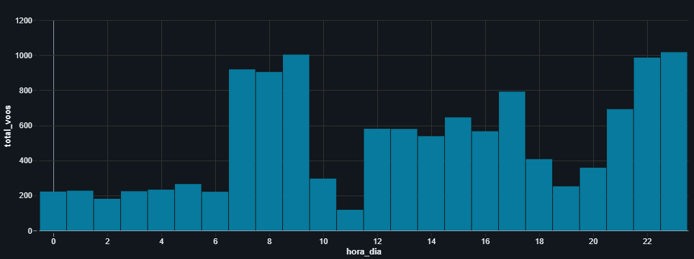

# ✈️ Pipeline de Engenharia de Dados: Aeroporto de Guarulhos (GRU) // English version below

## 📌 Sobre o Projeto
Este projeto desenvolve um pipeline de dados completo (ETL) para analisar as operações de voo do **Aeroporto Internacional de Guarulhos (GRU)**. Utilizando dados públicos da **ANAC**, foi construída uma arquitetura **Medallion (Bronze, Silver, Gold)** no Databricks para transformar dados brutos em inteligência de negócios.

O objetivo principal é demonstrar competências em **Engenharia de Dados**, **Qualidade de Dados** e **Analytics**, respondendo perguntas sobre horários de pico, atrasos e cancelamentos.

## 🛠️ Stack Tecnológico
* **Plataforma:** Databricks (Community Edition)
* **Processamento:** Apache Spark (PySpark) & SQL
* **Armazenamento:** Delta Lake
* **Formato de Dados:** CSV (Fonte) -> Delta (Tabelas Otimizadas)

## 📂 Estrutura do Projeto & Arquitetura
O projeto segue a arquitetura *Multi-hop* (Medallion), dividido nos seguintes notebooks:

### 1. `Extract~etl_gru_airport_(bronze-layer)`
**Fase de Ingestão (Raw -> Bronze)**
* Leitura dos arquivos `.csv` brutos da ANAC (Voo Regular Ativo).
* Padronização de nomes de colunas (Snake Case) para adequação a bancos de dados.
* Salvamento dos dados históricos na camada **Bronze** (Delta Lake).

### 2. `Transform~etl_gru_(silver-layer)`
**Fase de Limpeza e Enriquecimento (Bronze -> Silver)**
* **Filtragem de Escopo:** Seleção apenas de voos com Origem ou Destino em Guarulhos (SBGR).
* **Tipagem de Dados:** Conversão de colunas de data (String) para Timestamp real, permitindo cálculos temporais.
* **Limpeza:** Tratamento de valores nulos e remoção de inconsistências.

### 3. `Load~etl_gru_(gold-layer)`
**Fase de Agregação e Negócios (Silver -> Gold)**
* Criação de tabelas analíticas prontas para consumo (BI).
* **Análises Realizadas (SQL & PySpark):**
    * 🕒 **Picos de Horário:** Análise de fluxo de pista por hora do dia.
    * 🏆 **Market Share:** Ranking das companhias aéreas com maior volume.
    * 🐢 **Atrasos:** Cálculo de tempo médio de atraso (minutos) por empresa.
    * ❌ **Cancelamentos:** Volumetria de voos cancelados.

## 📊 Resultados e Insights
* Identificação visual dos picos de tráfego aéreo (Manhã e Noite) vs. Janelas de baixa (Madrugada).
* A **LATAM** e a **GOL** representam a vasta maioria das operações em GRU.
* Empresas de **Carga** tendem a ter médias de atraso maiores que as companhias comerciais de passageiros.
### Fluxo de Horários (Picos)

### Ranking de Cancelamentos

### Fluxo de Horários (Picos)

### Fluxo de Horários (Picos)

---
*Projeto desenvolvido para fins de estudo e portfólio de Engenharia de Dados.*

-------------
# ✈️ Data Engineering Pipeline: Guarulhos Airport (GRU)

## 📌 Project Overview
This project builds an end-to-end data pipeline (ETL) to analyze flight operations at **Guarulhos International Airport (GRU)**. Using public data from **ANAC (Brazilian Civil Aviation Agency)**, a **Medallion Architecture (Bronze, Silver, Gold)** was implemented on Databricks to transform raw data into business intelligence.

The main goal is to demonstrate proficiency in **Data Engineering**, **Data Quality**, and **Analytics**, answering business questions regarding peak hours, delays, and cancellations.

## 🛠️ Tech Stack
* **Platform:** Databricks (Community Edition)
* **Processing:** Apache Spark (PySpark) & SQL
* **Storage:** Delta Lake
* **Data Format:** CSV (Source) -> Delta (Optimized Tables)

## 📂 Project Structure & Architecture
The project follows a *Multi-hop* (Medallion) architecture, divided into the following notebooks:

### 1. `Extract~etl_gru_airport_(bronze-layer)`
**Ingestion Phase (Raw -> Bronze)**
* Reading raw `.csv` files from ANAC.
* Schema normalization (Snake Case) to ensure database compatibility.
* Persisting historical data into the **Bronze** layer (Delta Lake).

### 2. `Transform~etl_gru_(silver-layer)`
**Cleaning & Enrichment Phase (Bronze -> Silver)**
* **Scope Filtering:** Filtering only flights departing from or arriving at Guarulhos (SBGR).
* **Data Typing:** Converting date columns (String) to actual Timestamp objects, enabling temporal calculations.
* **Cleaning:** Handling null values and removing inconsistencies.

### 3. `Load~etl_gru_(gold-layer)`
**Aggregation & Business Logic Phase (Silver -> Gold)**
* Creating analytical tables ready for BI consumption.
* **Key Analyses (SQL & PySpark):**
    * 🕒 **Peak Hours:** Runway flow analysis by hour of the day.
    * 🏆 **Market Share:** Airline ranking by flight volume.
    * 🐢 **Delays:** Calculation of average delay time (in minutes) per airline.
    * ❌ **Cancellations:** Volume of cancelled flights.

## 📊 Results & Key Insights
* Visual identification of traffic peaks (Morning/Evening) vs. maintenance windows (Early morning).
* **LATAM** and **GOL** account for the vast majority of operations at GRU.
* **Cargo** airlines tend to have higher average delays compared to commercial passenger airlines.

## Peak Hour Traffic

## Cancellation Ranking

## Cancelled Flights by Airline

## Average Delay

---
*Project developed for Data Engineering portfolio purposes.*
