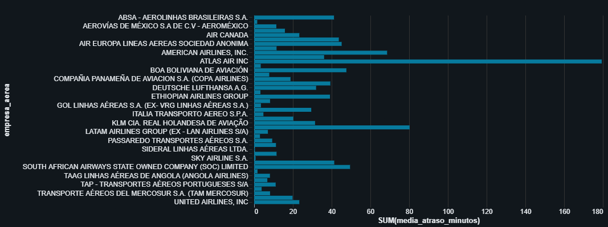

# ✈️ Pipeline de Engenharia de Dados: Aeroporto de Guarulhos (GRU)


[](https://www.linkedin.com/in/ericlesoliveira/)

> 📊 Pipeline ETL automatizado processando dados reais da ANAC com arquitetura Medallion (Bronze, Silver, Gold).

---

## 📌 Sobre o Projeto
Este projeto desenvolve um pipeline de dados completo (ETL) para analisar as operações de voo do **Aeroporto Internacional de Guarulhos (GRU)**. Utilizando dados públicos da **ANAC**, foi construída uma arquitetura **Medallion (Bronze, Silver, Gold)** no Databricks para transformar dados brutos em inteligência de negócios.

O objetivo principal é demonstrar competências em **Engenharia de Dados**, **Qualidade de Dados** e **Analytics**, respondendo perguntas sobre horários de pico, atrasos e cancelamentos.

## 📂 Estrutura do Projeto & Arquitetura

O projeto segue a arquitetura *Multi-hop* (Medallion). Abaixo, os links para visualização rápida (HTML):

| Etapa | Notebook | Descrição | Visualização |
|:---:|---|---|:---:|
| 🥉 | `Extract` | **Ingestão (Raw -> Bronze)**<br>Leitura de CSV e padronização Snake Case. | [📄 Ver Relatório](./docs/report_extract.html) |
| 🥈 | `Transform` | **Limpeza (Bronze -> Silver)**<br>Filtro de escopo (GRU), Tipagem de Datas e tratamento de nulos. | [📄 Ver Relatório](./docs/report_transformL.html) |
| 🥇 | `Load` | **Agregação (Silver -> Gold)**<br>Cálculo de KPIs: Picos, Market Share, Atrasos e Cancelamentos. | [📄 Ver Relatório](./docs/report_load.html) |

> **Nota:** Os arquivos de código fonte `.ipynb` estão na pasta `notebooks/`.

## 🛠️ Stack Tecnológico
* **Plataforma:** Databricks (Community Edition)
* **Processamento:** Apache Spark (PySpark) & SQL
* **Armazenamento:** Delta Lake
* **Formato de Dados:** CSV (Fonte) -> Delta (Tabelas Otimizadas)

---

## 📊 Resultados e Insights

### 1. Fluxo de Horários (Picos)
Identificação visual dos picos de tráfego aéreo (Manhã e Noite) vs. Janelas de baixa (Madrugada).


### 2. Market Share (Domínio de Mercado)
A **LATAM** e a **GOL** representam a vasta maioria das operações em GRU, seguidas pela Azul.


### 3. Ranking de Cancelamentos
Volume absoluto de voos cancelados por companhia aérea.


### 4. Média de Atrasos (Minutos)
Empresas de **Carga** (ex: Atlas Air) tendem a ter médias de atraso maiores que as companhias comerciais de passageiros.


## 🚀 Como Executar Este Projeto

### Pré-requisitos
* **Conta Databricks Community** (gratuita) - [Criar conta](https://community.cloud.databricks.com/)
* **Dados ANAC** (Voo Regular Ativo) - [Download aqui](https://siros.anac.gov.br/siros/registros/diversos/vra/2025/)

### Instalação e Execução

**1. Clone o repositório**
```bash
git clone https://github.com/loweri/engenharia-dados-aeroporto-gru-ETL.git
```
**2. Importe para o Databricks**
* Acesse seu workspace Databricks.
* Vá em **Workspace** > Clique com botão direito > **Import**.
* Navegue até a pasta `notebooks` deste repositório e importe os arquivos `.ipynb`.

**3. Configure os dados**
* Faça upload do arquivo `.csv` da ANAC para a aba **Catalog > Volumes** (ou via *Upload Data* no DBFS).
* **Importante:** Copie o caminho do arquivo (*Copy Path*) e atualize a variável `file_loc` na primeira célula do notebook `[1]_extract`.

**4. Execute na ordem**
* 1️⃣ `[1]_extract` (Ingere os dados brutos e salva a tabela Bronze)
* 2️⃣ `[2]_transform` (Limpa, padroniza e gera a tabela Silver)
* 3️⃣ `[3]_load` (Cria as agregações finais e gera os gráficos da Gold)
---

<details>
<summary>🇺🇸 <strong>Click here for English Version</strong></summary>

# ✈️ Data Engineering Pipeline: Guarulhos Airport (GRU)

## 📌 Project Overview
This project builds an end-to-end data pipeline (ETL) to analyze flight operations at **Guarulhos International Airport (GRU)**. Using public data from **ANAC (Brazilian Civil Aviation Agency)**, a **Medallion Architecture (Bronze, Silver, Gold)** was implemented on Databricks to transform raw data into business intelligence.

The main goal is to demonstrate proficiency in **Data Engineering**, **Data Quality**, and **Analytics**, answering business questions regarding peak hours, delays, and cancellations.

## 📂 Project Structure

| Stage | Notebook | Description | Quick View |
|:---:|---|---|:---:|
| 🥉 | `Extract` | **Ingestion Phase**<br>Raw data ingestion and schema normalization. | [📄 View Report](./docs/report_extract.html) |
| 🥈 | `Transform` | **Cleaning Phase**<br>Scope filtering (GRU only), Date typing, and null handling. | [📄 View Report](./docs/report_transformL.html) |
| 🥇 | `Load` | **Aggregation Phase**<br>Creating analytical tables and KPIs using SQL/PySpark. | [📄 View Report](./docs/report_load.html) |

> **Note:** Source code files `.ipynb` are located in the `notebooks/` folder.

## 📊 Key Insights

### 1. Peak Hour Traffic
Visual identification of traffic peaks (Morning/Evening) vs. maintenance windows.


### 2. Market Share
LATAM and GOL account for the vast majority of operations at GRU.


### 3. Cancellation Ranking
Total volume of cancelled flights by airline.


### 4. Average Delay
Cargo airlines tend to have higher average delays compared to commercial passenger airlines.


## 🚀 How to Run This Project

### Prerequisites
* **Databricks Community Account** (Free) - [Create account](https://community.cloud.databricks.com/)
* **ANAC Data** (Regular Active Flight) - [Download here](https://siros.anac.gov.br/siros/registros/diversos/vra/2025/)

### Installation and Execution

**1. Clone the repository**
```bash
git clone https://github.com/loweri/engenharia-dados-aeroporto-gru-ETL.git
```

**2. Import to Databricks**
* Access your Databricks workspace.
* Go to **Workspace** > Right-click > **Import**.
* Navigate to the `notebooks` folder of this repository and import the `.ipynb` files.

**3. Data Setup**
* Upload the ANAC `.csv` file to the **Catalog > Volumes** tab (or via *Upload Data* in DBFS).
* **Important:** Copy the file path (*Copy Path*) and update the `file_loc` variable in the first cell of the notebook `[1]_extract`.

**4. Run in order**
* 1️⃣ `[1]_extract` (Ingests raw data and saves the Bronze table)
* 2️⃣ `[2]_transform` (Cleans, standardizes, and generates the Silver table)
* 3️⃣ `[3]_load` (Creates final aggregations and generates Gold layer charts)

</details>

Project developed by Ericles Oliveira for Data Engineering portfolio purposes.
